# TryHackMe Brr Room - OT Hacking Write-up

> **Spoiler warning:** This repository documents the path used to complete the TryHackMe **Brr** room and includes screenshots of the decoded result.

## Overview

This write-up follows the room workflow from service discovery to reading Modbus register data in ScadaBR and decoding the resulting hexadecimal values with CyberChef.

The material is intended only for authorized labs, CTFs, and systems you have explicit permission to test.

## Walkthrough

### 1. Open the room

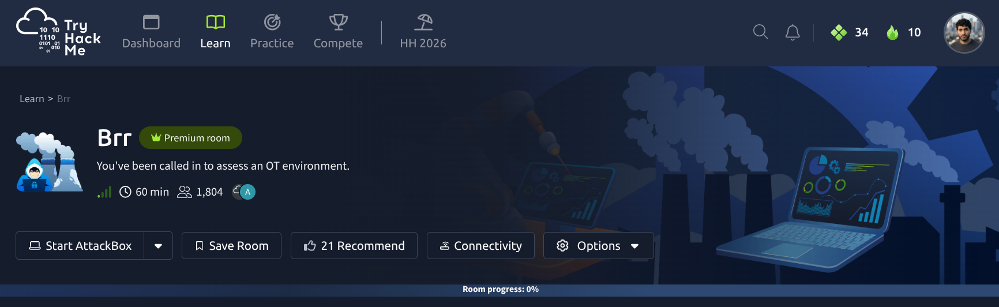

### 2. Enumerate the target with Nmap

The scan identifies several exposed services, including web services and a service on port `5020`. The source notes that `5020` is being used as a custom Modbus port rather than the standard port `502`.

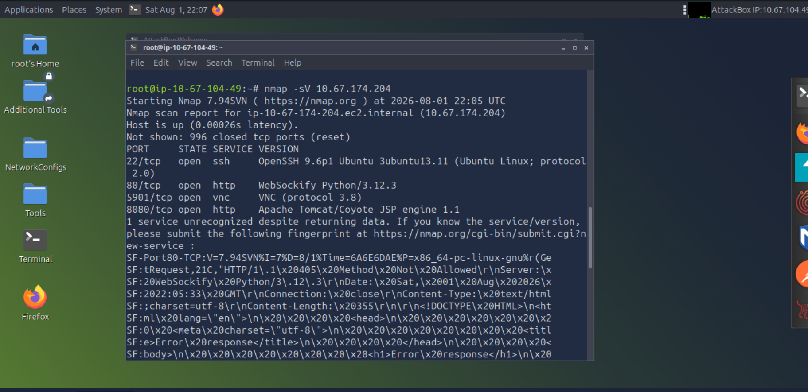

### 3. Check the web services

Opening the first web endpoint returns an HTTP `405 Method Not Allowed` response.

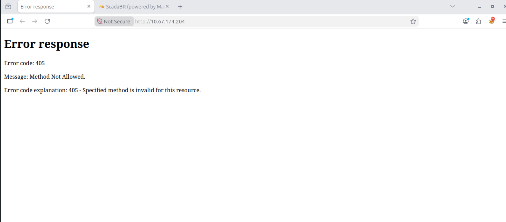

The service on port `8080` presents a ScadaBR login page.

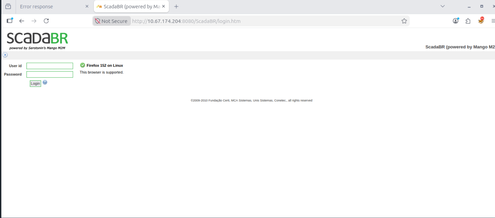

### 4. Log in to ScadaBR

The default credentials found for this lab are:

```text
Username: admin
Password: admin
```

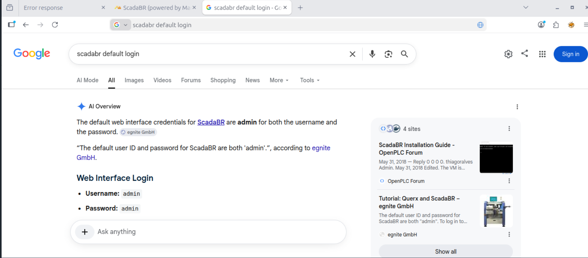

After authentication, the ScadaBR dashboard is accessible.

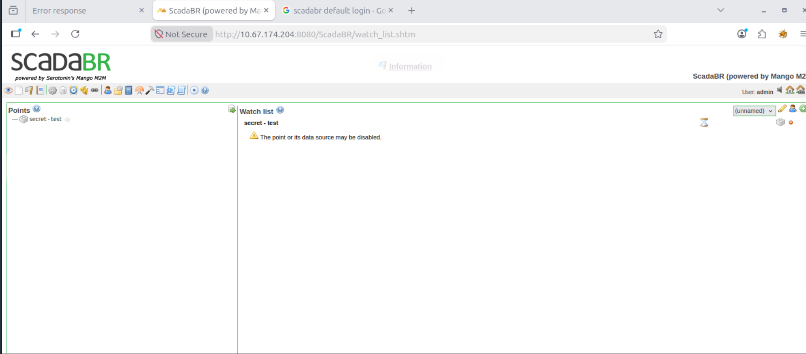

### 5. Inspect the data source

From the ScadaBR menu, open **Data Sources**. The relevant entry can be edited using the control beside its status.

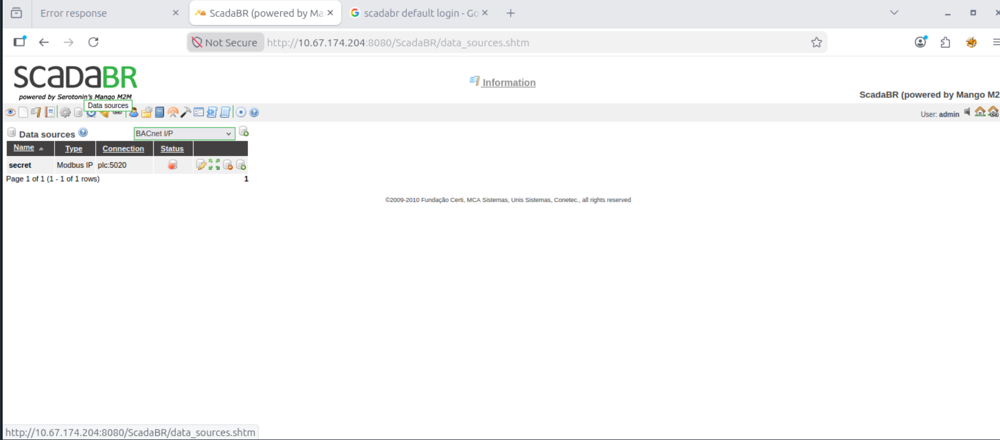

The **Modbus read data** panel can query values from different register ranges. In this room, it is used to inspect the raw values exposed by the Modbus service.

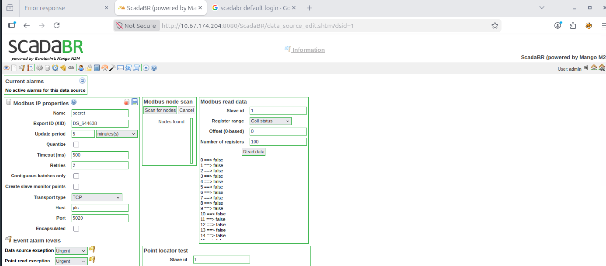

Iterating through the register ranges reveals values that can be copied for decoding.

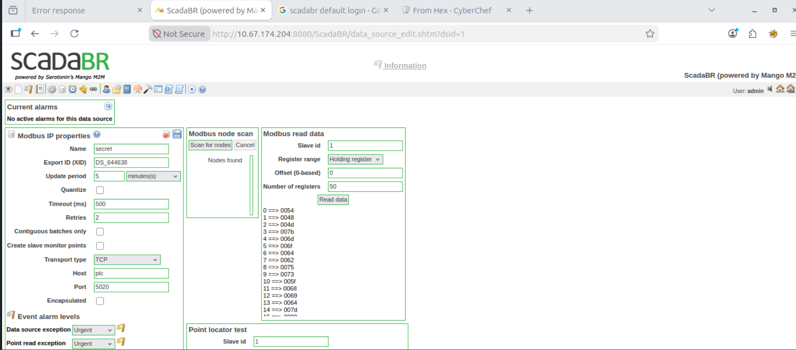

### 6. Decode the register data

Paste the register values into CyberChef and use **From Hex**.

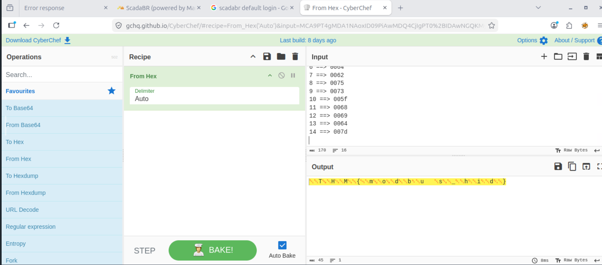

Remove the extra line breaks or null bytes as needed to reveal the room output.

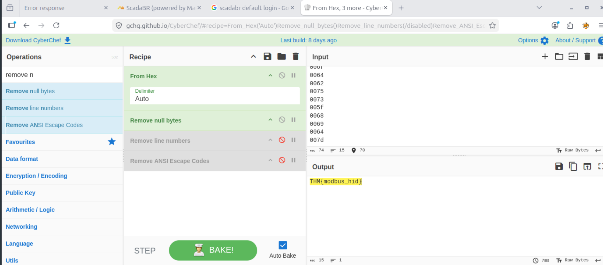

## Repository structure

```text
.
├── README.md
└── screenshots
    ├── 01-room-overview.png
    ├── 02-nmap-scan.png
    ├── 03-port-80-error-response.png
    ├── 04-scadabr-login-page.png
    ├── 05-default-credentials-search.png
    ├── 06-scadabr-dashboard.png
    ├── 07-data-sources.png
    ├── 08-modbus-read-data-panel.png
    ├── 09-modbus-register-values.png
    ├── 10-cyberchef-from-hex.png
    └── 11-cyberchef-decoded-output.png
```

## Notes

- The target IP shown in the screenshots belongs to the temporary TryHackMe lab session used when the write-up was created.
- Default credentials should only be tested in an authorized environment.
- This README was prepared from the supplied write-up document, with spelling and formatting cleaned up for GitHub.
